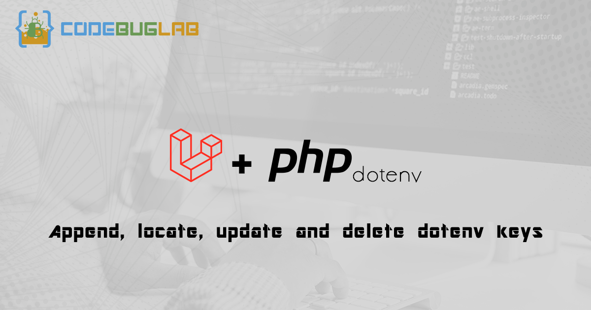

# Laravel Env <!-- omit in toc -->

Laravel small package to locate, append and update `.env` keys.



## Disclaimer <!-- omit in toc -->

**TO BE ABLE TO UPDATE `.env` FILE THROUGH BROWSER YOU MAY NEED TO CHANGE `.env` FILE PERMISSIONS TO _755_. THIS WILL MAKE YOUR FILE WRITABLE VIA BROWSER.**

**YOU SHOULD NOT HAVE `.env` IN YOUR PUBLIC ROOT, EX: `public_html`**


## Table of contents <!-- omit in toc -->
- [Setup](#setup)
    - [Installation](#installation)
- [Available methods](#available-methods)
  - [get](#get)
  - [append](#append)
  - [replace](#replace)
  - [delete](#delete)
  - [locate](#locate)
  - [reset](#reset)

## Setup
### Installation

To install this package through composer run the following command in the terminal

```bash
composer require codebuglab/laravel-env
```

## Available methods

### get

```php
\CodeBugLab\Env::get('APP_KEY', 'default');
```

### append

```php
\CodeBugLab\Env::append('LOG_CHANNEL', 'daily');
```

### replace

```php
\CodeBugLab\Env::replace('APP_KEY', 'another key');
```

### delete

```php
\CodeBugLab\Env::delete('FOO');
```

### locate

Returns a `CodeBugLab\Env\Line` object

```php
$line = \CodeBugLab\Env::locate('APP_KEY');
```

### reset

Set to empty value

```php
\CodeBugLab\Env::reset('APP_KEY'); // APP_KEY=""
```
